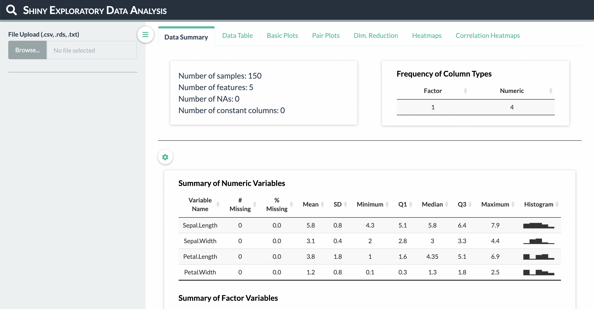
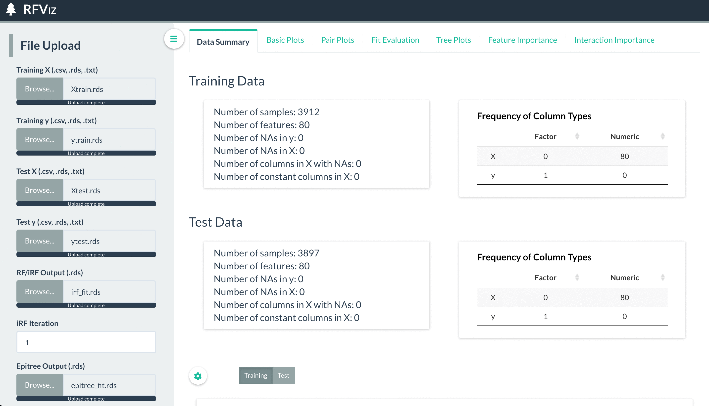

# Shiny-Apps

## ShinyEDA

An app for quick exploratory data analysis and visualizations ranging from basic histograms, boxplots, and density plots to pair plots, PCA plots, and clustered heatmaps.

Launch application via

```R
shiny::runGitHub(repo = "tiffanymtang/Shiny-Apps", subdir = "ShinyEDA")
```

or visit https://tiffanymtang.shinyapps.io/ShinyEDA/.



## RFViz

An app for visualizing random forest results at a detailed level including visualizations for feature importances, tree-level statistics, and interactions. Also contains visualization functionalities for iterative random forest and epiTree.

Launch application via

```R
shiny::runGitHub(repo = "tiffanymtang/Shiny-Apps", subdir = "RFViz")
```

or visit https://tiffanymtang.shinyapps.io/RFViz/.


